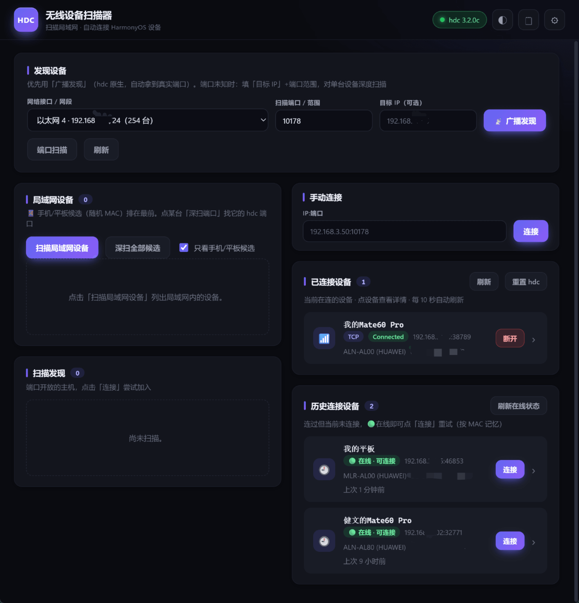

<div align="center">

# GetHdcDevices

**一个 Windows 桌面应用：自动发现并一键无线连接 HarmonyOS / OpenHarmony 设备，无需手敲 `hdc` 命令。**

[](https://tauri.app/)
[](https://www.rust-lang.org/)
[](https://www.typescriptlang.org/)
[](#环境要求)

[English](./README.md) · 简体中文

</div>

---

## 简介

用 `hdc`（HarmonyOS Device Connector）无线连接鸿蒙设备，通常要敲好几条命令，还得猜系统随机分配的端口。**GetHdcDevices** 把整套流程包进一个小巧的原生桌面界面：自动扫描局域网内的设备、拿到它们真实的 `hdc` 端口、一键连接，然后常驻系统托盘。

产物为单个原生 `.exe` / `.msi`（约 5 MB），内存占用低。技术栈：**Tauri 2（Rust 后端） + Vanilla TypeScript + Vite（前端）**。

> [!NOTE]
> **为什么需要专门的工具？** HarmonyOS 的无线调试端口是系统**随机分配**的（如 `38789`、`46853`，并非固定的 `10178`），并且设备通常会**丢弃 ICMP 和关闭的 TCP 探测**（既不回 ping 也不回 RST）。因此「固定端口 / 整网段盲扫」既慢又扫不全。最可靠的方式是 `hdc discover`——由设备主动广播上报真实端口，这也正是 DevEco Studio 底层的做法。

## 截图

<div align="center">



<sub>主界面 —— 发现设备（广播 / 端口扫描）、一键连接、已连接与历史设备管理。</sub>

</div>

## 功能特性

- 🖧 **局域网设备发现** —— 基于 ARP 表列出设备（即使设备丢 ICMP/TCP 也能列出）。现代手机/平板使用**随机 MAC**，据此标记为「手机/平板候选」并排在最前。可对单台「深扫端口」，也可「**深扫全部候选**」自动遍历。
- 📡 **广播发现** —— 调用原生 `hdc discover`（UDP 广播），让设备主动上报真实 `IP:端口`。首次需放行 **UDP 8710** 入站；应用内提供「**添加防火墙规则**」一键按钮（点击时弹 UAC）。_注意：VPN / 虚拟网卡 / 代理网络下 UDP 广播可能不通，此时改用「局域网设备 → 深扫端口」。_
- 🔍 **端口扫描（免防火墙备选）** —— 多线程异步 TCP 探测。可对整网段扫小端口列表，或在端口未知时对单台设备做「**目标 IP + 端口范围**」深度扫描（如 `32768-60999`）。
- 🔌 **一键连接 / 断开** —— `hdc tconn <ip:port>` / `tconn -remove`。
- 📋 **已连接设备** —— 解析 `hdc list targets -v`，显示连接类型（USB/TCP）与状态，每 10 秒自动刷新。
- 📶 **开启无线模式** —— 对 USB 连接的设备执行 `hdc tmode port <port>`（设备会重启并进入 TCP 监听）。
- 🧠 **设备记忆与历史** —— 按 MAC 绑定自定义备注/名称；历史设备重新在线（🟢）时可一键重连。
- ⌨️ **手动连接** —— 直接输入 `IP:端口` 连接。
- 🎨 **多主题** —— 4 套现代配色（eclipse / carbon / daybreak / mist），明暗皆备，切换即时无闪烁。
- 🌐 **多语言界面** —— 支持英文、简体中文、香港繁体，下拉即可切换。首次启动自动识别系统语言（无法匹配时回退英文）。
- 🖥️ **系统托盘** —— 关闭窗口最小化到托盘；托盘菜单提供 显示 / 扫描 / 开机自启 / 退出，左键单击托盘图标唤出窗口。
- 🚀 **开机自启动** —— 可选在 Windows 登录后最小化到托盘后台启动。
- ⚙️ **设置** —— 自定义 `hdc` 路径（默认自动检测）、扫描端口、无线端口、超时、并发数（保存在本地）。

## 无线 `hdc` 连接原理

本应用自动化的标准流程：

1. 先用 **USB** 连接设备，执行 `hdc tmode port <端口>`（即「**开启无线**」按钮）进入 TCP 监听模式。设备会重启，之后在同一局域网内监听**系统分配的端口**（通常为随机高端口）。
2. PC 端执行 `hdc tconn <设备IP>:<端口>` 连接。

发现设备的两种方式：

| 方式 | 机制 | 说明 |
| --- | --- | --- |
| **广播发现**（推荐） | `hdc discover`（UDP），设备主动上报真实 `IP:端口` | 需放行 UDP 8710 入站（一键添加规则）。与 DevEco Studio 一致，最可靠。 |
| **端口扫描** | 并发 TCP 探测端口是否开放 | 整网段盲扫大端口段**不可行**（设备丢弃关闭端口/ICMP）。端口未知时请填「目标 IP + 范围」对单台扫描。开放端口仅为候选，连接成败以 `hdc tconn` 为准。 |

## hdc 自动检测顺序

应用按以下顺序自动定位 `hdc` 可执行文件：

1. **设置**里手动指定的路径
2. 系统 `PATH`
3. OpenHarmony SDK 安装目录
   （`%LOCALAPPDATA%\OpenHarmony\Sdk\<版本>\toolchains\hdc.exe`，自动选最高版本）

环境变量 `HDC_SERVER_PORT` 会被自动继承（由 `hdc` 自身读取）。

## 环境要求

- **Windows 10/11**，含 **WebView2 Runtime**（Win11 已内置）
- OpenHarmony SDK 中的 **`hdc`**（用于实际连接设备）

开发还需要：

- [Rust](https://rustup.rs/)（已验证 1.95）
- [Node.js](https://nodejs.org/)（已验证 v24）+ npm

## 快速开始

### 开发模式运行

```bash
npm install
npm run tauri dev
```

### 打包（安装包 / exe）

```bash
npm run tauri build
```

产物位于 `src-tauri/target/release/`：

- 可执行文件：`GetHdcDevices.exe`
- 安装包：`bundle/msi/*.msi`、`bundle/nsis/*-setup.exe`

## 项目结构

```
GetHdcDevices/
├─ index.html            # UI 结构
├─ src/
│  ├─ main.ts            # 前端逻辑（调用 Tauri 命令、事件、渲染、主题）
│  ├─ i18n.ts            # 多语言文案 + 语言检测（en / zh-CN / zh-HK）
│  └─ styles.css         # 主题化的 token 系统（明/暗）
└─ src-tauri/
   ├─ src/
   │  ├─ lib.rs          # Tauri 命令注册 + 系统托盘 + 关闭到托盘 + 开机自启
   │  ├─ hdc.rs          # 定位 hdc、执行命令、解析 list targets、hdc discover
   │  └─ scan.rs         # 网卡枚举 + 异步并发子网/ARP 扫描
   ├─ tauri.conf.json    # 应用配置（窗口、打包、图标）
   └─ Cargo.toml
```

## 技术栈

| 层 | 技术 |
| --- | --- |
| 外壳 / 运行时 | [Tauri 2](https://tauri.app/)（原生 WebView2） |
| 后端 | Rust（Tokio 异步、系统托盘、防火墙/注册表集成） |
| 前端 | Vanilla TypeScript + [Vite](https://vitejs.dev/) |
| 打包 | MSI + NSIS 安装包，单 `.exe` |

## 贡献

欢迎提 Issue 和 Pull Request。请保持改动聚焦，并与现有代码风格一致。

## 许可证

当前仓库尚未包含许可证文件。在添加之前，版权归作者所有、保留所有权利——如需指定某种开源许可证，请提 Issue。
```
